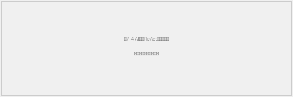

## 7.3 智能分析与AI决策

隧道施工监测积累的大量沉降、裂缝、温度和振动数据，蕴含着围岩变形演化、支护结构受力变化和施工扰动传播等重要工程信息。然而，仅凭人工经验逐一比对数据曲线来发现潜在风险，既效率有限又容易遗漏关键异常。将机器学习与数据驱动分析方法引入隧道监测体系，能够从海量历史观测中自动提取变形规律、识别异常模式并预测未来趋势，为施工决策提供定量化的技术支撑。本节从机器学习模型的部署策略、预测分析链路、异常检测引擎、高级分析功能、风险预警机制和AI智能助手六个方面，系统阐述智能分析模块的设计与实现方案。

{#fig:7-3}

### 一、机器学习模型部署与轻量化替代策略

隧道监测智能分析功能依赖多种机器学习模型的协同运行，包括时序预测模型、异常检测模型、因果推断模型和可解释性分析模型等。在传统的服务器部署环境下，上述模型可通过预装完整的Python科学计算库（PyTorch、TensorFlow等）直接加载运行；然而，本系统采用Vercel Serverless无服务器架构部署后端服务，该架构对运行环境施加了严格的资源约束——单个函数的内存上限为1024MB，最长执行时间为60秒，且冷启动时需要在短时间内完成所有依赖库的加载。若在服务启动时一次性导入全部深度学习框架和模型文件，仅PyTorch一项即超过500MB，将直接导致内存溢出或启动超时。

针对上述部署约束，系统设计了"条件导入—轻量替代—Mock降级"三级自适应加载策略。第一级为条件导入机制：系统在启动阶段不加载任何机器学习库，而是为每类模型设置独立的可用性标志，共计11个布尔标志分别对应Prophet时序预测、Informer长序列预测、STGCN时空图卷积、PINN物理信息神经网络、Ensemble集成学习、轻量替代模块、SHAP可解释性、Neo4j图数据库、Supabase知识图谱、因果推理引擎和知识图谱问答等模型组件。只有当用户实际调用某项分析功能时，系统才在对应的API路由处理函数内部尝试导入所需库，导入成功则将相应标志置为True，导入失败则置为False并转入下一级策略，整个过程对用户完全透明。第二级为轻量替代策略：当PyTorch等重型框架无法加载时，系统自动启用基于Scikit-learn的轻量化替代实现。具体而言，Informer模型的替代方案采用梯度提升回归器配合1至7阶滞后特征构建时序预测能力；STGCN的替代方案采用随机森林回归器，通过引入5个最近邻监测点的观测值作为空间特征来模拟图卷积的空间信息聚合效果；PINN的替代方案将梯度提升回归器的数据驱动预测结果与基于Terzaghi一维固结理论计算的物理约束项进行加权融合，通过可调节的物理权重参数平衡数据拟合与物理规律之间的关系；Ensemble集成学习的替代方案则组合梯度提升、随机森林和二次多项式回归三个基学习器，以加权平均方式输出最终预测值。上述轻量替代模型均保持与原始深度学习模型相同的输入输出接口，上层调用代码无需任何修改即可无缝切换。第三级为Mock降级：当运行环境极度受限、连Scikit-learn基础库也无法正常加载时，系统采用随机数生成器在合理的工程数值范围内构造模拟结果，并在返回数据中附加"mock:true"标志，前端界面据此提示用户当前结果仅供参考而非真实模型推理输出，确保系统在任何部署环境下均不会因模型加载失败而中断服务。

### 二、预测分析全链路

沉降预测是隧道施工监测中最核心的分析需求之一，工程人员需要根据已有的累计沉降观测数据，预判未来7至30天内各监测断面的沉降发展趋势，从而为支护参数调整和施工进度安排提供前瞻性依据。系统为此构建了从前端请求发起、后端模型自动选择到预测结果返回的完整链路。

预测链路的核心在于模型自动选择机制。不同监测点的沉降时间序列具有不同的数据特征——有的序列数据量充足且呈现明显的季节性波动，适合采用Prophet等分解模型；有的序列较短且趋势单一，简单的线性回归即可获得良好拟合效果；还有的序列波动剧烈、非平稳性显著，则需要ARIMA等差分模型来处理。人工逐点选择模型既不现实也容易引入主观偏差。为此，系统实现了四步自动选择流程：第一步为数据特征分析，模型选择器从输入时间序列中提取6个统计特征，包括数据长度、趋势强度（以线性拟合的决定系数R²衡量）、波动程度（以变异系数衡量）、季节性强度、平稳性和离群值比例，这些特征从不同维度刻画了时间序列的结构特点。第二步为规则推荐，系统根据上述特征给出初始模型建议——当数据量少于30条时推荐线性回归以避免过拟合，当波动程度较高时推荐ARIMA模型以捕捉非平稳动态，当数据量充足（100条以上）且存在周期性时推荐Prophet模型以发挥其趋势分解优势。第三步为实证评估，系统将历史数据按8:2比例划分为训练集和测试集，在规则推荐的候选模型以及线性回归、ARIMA、SARIMA、Prophet四类基础模型上逐一进行回测，计算各模型在测试集上的预测误差。第四步为贪心选择，系统以平均绝对误差（MAE）为默认评价指标，选取误差最低的模型作为该监测点的最优预测模型，并将选择结果缓存至本地文件，后续对同一监测点的重复预测请求可直接复用已选模型而无需重复评估，提高了响应效率。

整个预测链路的调用流程如下：前端页面发起预测请求时，将监测点编号、预测步长和评价指标作为参数传递至后端API接口；后端首先从数据库获取该监测点的历史沉降序列，随后调用模型选择器执行上述四步流程完成模型选择与训练；最终返回的预测结果包含未来各日期的预测值、置信区间上下界以及模型选择的详细信息（包括各候选模型的评估得分），便于工程人员了解预测依据并评判结果的可信度。

### 三、异常检测引擎

隧道施工期间，监测数据中偶发的异常波动往往是围岩失稳、支护变形或施工扰动等工程风险的前兆信号。及时识别这些异常并判断其严重程度，对于预防安全事故具有重要意义。然而，沉降监测网络通常包含数十个测点，每个测点每日产生一条以上的观测记录，依靠人工逐一审查全部数据曲线来发现异常既耗时又容易遗漏。为此，系统构建了基于多维特征工程与双模型协同的自动异常检测引擎。

异常检测的第一步是将原始的一维沉降时间序列扩展为多维特征向量，以便从不同角度刻画数据的变化模式。系统对每个监测点的历史观测序列提取8个特征维度：（1）累计沉降值，反映测点当前的绝对变形状态；（2）日沉降速率，即相邻两次观测值的一阶差分，反映变形发展的即时速度；（3）7日移动平均值，用于平滑短期波动、揭示近期变形趋势；（4）7日滚动标准差，衡量近期观测值的离散程度，标准差越大说明数据波动越剧烈；（5）加速度，即日沉降速率的一阶差分（原始值的二阶差分），反映变形速度是否在加快或减缓；（6）偏离均线程度，定义为当前观测值与7日移动平均值之差，用于检测突然偏离正常趋势的观测值；（7）14日移动平均值，作为中长期趋势的参考基线；（8）趋势差，定义为7日移动平均与14日移动平均之差，当短期均线显著偏离长期均线时，提示变形趋势可能发生转折。上述8个特征从绝对值、变化速度、波动性、加速度和趋势偏离等多个层面构建了对沉降行为的全面描述，为后续的异常模式识别提供了丰富的判别信息。

在特征工程的基础上，系统采用Isolation Forest（孤立森林）和LOF（局部离群因子）两种无监督学习模型协同进行异常检测。孤立森林算法通过随机选择特征和分割点递归划分数据空间，异常样本由于偏离多数数据分布，通常只需较少的分割次数即被"孤立"出来，分割次数越少则异常程度越高。系统配置孤立森林使用100棵决策树，预设污染率为5%（即假定数据中约有5%的观测存在异常），随机种子固定为42以保证结果可复现。LOF算法则从局部密度的角度评估异常，它计算每个样本与其近邻的密度比值，若某样本所在区域的密度显著低于其邻域，则判定为离群点，系统将LOF的近邻数设为20，同样以5%的污染率运行。两种模型从不同的数学原理出发——孤立森林侧重全局分布的孤立性判断，LOF侧重局部密度的相对偏离——对同一数据集进行独立检测，综合两者的结果可以提高异常识别的鲁棒性，降低单一模型可能带来的误检或漏检风险。

检测到异常后，系统进一步对异常严重程度和类型进行分级分类。严重度分级基于异常分数的百分位数：异常分数位于全部异常样本前25%的判定为"危急"级别，25%至50%之间为"高"级别，50%至75%之间为"中等"级别，其余为"低"级别。异常类型的分类则依据8维特征中的关键指标：当日沉降速率绝对值超过0.5时，判定为"突变型"异常，提示可能发生了突发性地层变形；当加速度绝对值超过0.2时，判定为"加速型"异常，表明沉降速度正在持续加快；当7日滚动标准差超过0.3时，判定为"波动型"异常，说明观测数据出现了不规则的剧烈震荡；当偏离均线程度超过1.0时，判定为"趋势偏离型"异常，意味着当前变形行为已显著偏离近期的正常演化轨迹。上述分级与分类结果以结构化数据形式返回前端，在异常扫描仪表盘中按红色（危急）、橙色（高）、黄色（中等）和绿色（正常）四级颜色直观展示各监测点的健康状态，帮助工程管理人员在数十个监测点中快速锁定需要优先处置的异常区域。

### 四、高级分析功能模块

除基础的预测与异常检测外，隧道工程监测还需要从更深层次揭示变形的驱动因素和空间传导规律，为工程决策提供多维度的分析支撑。系统将多种高级分析功能集成于统一的分析工作台页面中，按照"发现问题—预测趋势—追溯原因—综合研判"的分析逻辑，将10个分析面板组织为5个功能组，形成从异常发现到决策建议的完整分析闭环。

第一组为问题发现，包含异常扫描仪表盘和处置建议面板。异常扫描仪表盘一次性对全部25个监测点执行批量异常检测，按上述四级颜色标注每个测点的异常状态和严重等级，并自动统计各等级的点位数量，使工程人员可在一个视图内总览全场监测网络的整体健康状况。处置建议面板则针对已识别的异常，基于异常类型和严重程度自动生成相应的处置方案建议，辅助现场管理人员制定应急响应措施。

第二组为趋势预测，包含常规预测仪表盘和深度学习预测仪表盘。常规预测仪表盘调用前述模型自动选择链路，为指定监测点生成7至30天的沉降预测曲线及其置信区间。深度学习预测仪表盘则专门调用Informer、STGCN和PINN三类深度学习模型（或其轻量替代版本），展示不同模型架构在长期预测任务上的表现差异，便于研究人员对比评估各模型在特定工程场景下的适用性。

第三组为根因追溯，包含因果分析仪表盘和可解释性分析仪表盘。因果分析仪表盘整合了两项功能：其一为因果推断分析，系统基于施工事件日志与沉降时间序列的时间对应关系，采用事件前后对比方法评估特定施工活动（如爆破开挖、注浆加固等）对监测数据的影响程度；其二为空间关联分析，系统计算各监测点之间沉降序列的相关系数矩阵，识别空间上变形联动的测点群组，揭示地层变形的空间传导路径。可解释性分析仪表盘基于SHAP（SHapley Additive exPlanations）方法，对预测模型的输出进行特征重要性分解，以可视化的方式展示哪些输入特征对预测结果的贡献最大，增强模型预测的可解释性和工程可信度。

第四组为综合研判，以知识图谱仪表盘为核心。该仪表盘基于NetworkX图计算库构建隧道监测领域的内存知识图谱，图中的节点代表各监测点，边代表监测点之间的空间近邻关系和统计相关性。通过图查询可以快速检索指定监测点的邻域影响范围、追踪因果传导链路以及筛选高风险节点群组。知识图谱还支持文档管理功能，工程人员可将地质勘察报告、设计变更通知等工程文档录入系统，通过知识图谱问答接口以自然语言提问的方式检索相关信息，实现监测数据与工程文档的知识融合。

### 五、风险预警与自动告警机制

智能分析的最终目标是将模型输出的数值结果转化为工程人员可直接响应的风险预警信息。系统建立了以沉降预测和异常检测结果为核心数据源的风险预警机制，通过多维度信息聚合与量化评分，实现对各监测点风险等级的自动研判与分级告警。

风险预警的生成流程如下：系统首先汇总全部监测点的预测分析结果，将每个点位的未来沉降预测值与预设的工程控制阈值进行比较，同时综合该点位近期的异常检测结果（包括异常频次、最高严重等级和异常类型分布）、空间关联异常情况（相邻点位是否同步出现异常）以及历史变形趋势特征（沉降速率是否持续增大），按权重计算得到一个量化的风险评分。根据风险评分的高低，系统将各监测点划分为"危急""高风险""中风险"和"低风险"四个等级，其中危急和高风险等级的监测点将被纳入告警列表，按风险评分从高到低排序后推送给工程管理人员。告警信息包含监测点编号、当前累计沉降值、预测未来变形量、触发告警的具体原因以及建议的应急处置措施，使管理人员在接收告警后能够快速了解风险详情并做出响应决策。该预警机制将原本分散在预测、异常检测和空间分析等不同功能模块中的分析结果进行了有机整合，避免了工程人员在多个分析界面之间来回切换查找信息的低效操作，实现了从"数据→分析→预警→决策建议"的完整闭环。

### 六、AI智能助手

面对系统提供的众多分析功能和海量监测数据，不同专业背景和技术水平的用户在使用系统时可能面临操作路径不清晰、分析结果难以解读等问题。为降低智能分析功能的使用门槛，系统集成了基于大语言模型的AI智能助手，用户可通过自然语言对话的方式查询监测数据、调用分析功能和获取工程建议，无需逐一记忆各分析模块的操作入口和参数设置。

AI助手的核心采用ReAct（Reasoning and Acting）推理框架实现。ReAct框架将大语言模型的推理过程结构化为"思考—行动—观察"三步循环：在每一轮迭代中，模型首先分析用户意图并推理当前应采取的行动（思考阶段），随后调用相应的数据查询或分析工具执行具体操作（行动阶段），最后根据工具返回的结果进行判断，决定是否需要继续调用其他工具或直接生成最终回复（观察阶段）。系统为ReAct引擎配备了16个专用工具，覆盖监测数据查询（监测点列表查询、沉降数据查询、温度数据查询、裂缝数据查询）、智能分析调用（异常检测、沉降预测、相关性分析、异常批量查询）、知识图谱操作（知识图谱构建与查询、知识图谱问答）以及辅助功能（施工事件查询、温度风险评估、温度处置方案、分析摘要查询、学术文献检索）等四大类能力，使助手能够在对话过程中动态调用系统的各项分析功能获取实时数据，而非仅依赖语言模型的静态知识作答。考虑到Serverless环境的执行时间限制，系统将ReAct循环的最大迭代次数设为2次，单次请求的硬超时设为45秒，工具返回结果超过2000字符时自动截断并保留最重要的前5条记录，从而在推理深度与响应速度之间取得平衡。

{#fig:7-4}

为提高意图识别的效率，系统在ReAct推理之前设置了基于关键词和正则表达式的意图预分类层。该分类器根据用户输入中出现的领域关键词（如"沉降""裂缝""温度""预测""异常"等）和句式模式，将用户意图快速路由至对应的功能类别，并据此将传递给大语言模型的可用工具集从全部16个缩减至与当前意图最相关的1至5个。这一设计显著减少了大语言模型在工具选择阶段需要处理的候选项数量，降低了Token消耗和选择错误的概率，加快了推理响应速度。

在用户交互层面，AI助手以浮动按钮的形式常驻于系统界面右下角，点击后展开对话面板，支持多轮上下文连续对话。助手的响应采用SSE（Server-Sent Events）流式传输技术实现，后端在推理过程中将思考步骤、工具调用进展和最终回复文本以事件流的形式逐步推送至前端浏览器，用户可以实时观察助手的推理过程——包括当前正在调用哪个分析工具、工具返回了什么中间结果——而非等待全部处理完成后才看到一次性的最终回复。流式传输共定义了5种事件类型：thinking（展示当前推理步骤）、tool_start（提示开始调用某工具）、tool_end（展示工具执行结果摘要）、text_delta（增量输出回复文本）和done（标记响应结束），整个推理过程对用户完全可见，增强了人机交互的透明度和用户对分析结果的信任感。

### 七、本节小结

综上所述，系统的智能分析模块围绕隧道施工监测的实际需求，构建了从模型部署到风险预警的完整技术体系。三级自适应加载策略（条件导入—轻量替代—Mock降级）解决了无服务器架构下机器学习模型的部署难题，使系统在云端受限环境和本地完整环境中均能提供智能分析服务。四步模型自动选择流程将模型评估与选择过程标准化，免除了人工逐点选模型的繁琐操作。基于8维特征工程和双模型协同的异常检测引擎实现了对多类异常模式的自动识别与分级预警。涵盖异常扫描、趋势预测、因果分析、可解释性和知识图谱的高级分析工作台为工程决策提供了多维度的技术支撑。基于ReAct框架和SSE流式传输的AI智能助手降低了复杂分析功能的使用门槛，使不同技术背景的用户均能通过自然语言对话便捷地获取监测数据分析结果。上述各模块相互协同，共同构成了面向隧道施工安全监测的数据驱动智能决策支持体系，系统集成的主要机器学习模型及其功能定位如表7-3所示。

**表7-3 系统集成的机器学习模型清单**

  --------------------------------------------------------------------------------------------
  模型名称              功能定位                              轻量替代方案
  --------------------- ------------------------------------- --------------------------------
  Prophet               时序分解与趋势预测                    ExponentialSmoothing（指数平滑）

  ARIMA/SARIMA          非平稳序列差分预测                    —（原生Scikit-learn实现）

  Informer              长序列时序预测                        GradientBoosting+滞后特征

  STGCN                 时空图卷积多点联合预测                RandomForest+近邻空间特征

  PINN                  物理信息约束神经网络                  GradientBoosting+Terzaghi物理项

  Ensemble              多模型集成学习                        GB+RF+多项式加权平均

  Isolation Forest      基于孤立性的异常检测                  —（原生Scikit-learn实现）

  LOF                   基于局部密度的异常检测                —（原生Scikit-learn实现）

  SHAP                  模型可解释性分析                      —（依赖原生SHAP库）

  NetworkX知识图谱       监测点空间关系与知识融合              —（纯Python图计算）
  --------------------------------------------------------------------------------------------

