# 第7章 系统实现

## 7.1 系统功能与平台架构

城市大型地下基础设施暗挖建造过程中，隧道围岩变形、地表沉降、裂缝扩展、环境振动等多源异构监测数据的实时采集与协同管控，对信息化平台的架构设计和工程化实现能力提出了较高要求。本章基于前文的需求分析与系统设计方案，从工程实现角度阐述隧道监测数字孪生平台的技术路线与核心模块开发过程。针对隧道施工现场数据来源分散、监测指标类型多样、管理层级差异显著等实际问题，本系统采用前后端分离的Browser/Server架构，前端基于React构建面向不同角色的交互界面，后端基于Flask提供数据服务与智能分析接口，数据层通过工厂模式支持云端与本地数据库的灵活切换，以适应隧道项目从原型验证到现场部署的不同阶段需求。全章围绕数据采集与融合、智能分析与人工智能（ArtificialIntelligence，简称AI）决策、集群控制与远程管控三个方面，展开各功能模块的实现细节。

围绕隧道暗挖施工全过程的监测管控需求，系统将业务划分为四大功能域，共计15个功能模块，如表7-1所示。第一类为变形与结构安全监测，涵盖地表沉降监测、围岩裂缝监测、钢筋应力监测及InSAR卫星遥感（InterferometricSynthetic ApertureRadar，简称InSAR）地表形变分析四个模块，分别对应隧道施工中最为关键的竖向位移、结构损伤、受力状态和区域形变四类监测指标。第二类为施工环境监测，包括隧道内温湿度采集和施工振动监测两个模块，用于掌握洞内环境参数和爆破振动对周边建构筑物的影响。第三类为施工过程管控，包含盾构机轨迹追踪、施工工单管理、隧道断面管理和数据批量导入四个模块，支撑从掘进参数监控、问题闭环处理到断面级风险评估的施工管理流程。第四类为智能分析与决策，包括沉降预测分析、多指标异常检测、高级统计分析、AI智能助手和总览仪表盘五个模块，为工程师提供从趋势预判、异常预警到辅助决策的全链路智能分析能力。

*表7-1 系统功能模块划分*

| 功能域 | 模块名称 | 监测/管理对象 |
| --- | --- | --- |
| 变形与结构安全监测 | 地表沉降监测 | 隧道沿线各断面地表竖向位移 |
|  | 围岩裂缝监测 | 隧道衬砌及周边结构裂缝宽度与发展趋势 |
|  | 钢筋应力监测 | 支护结构钢筋受力状态 |
|  | InSAR地表形变 | 卫星遥感覆盖区域的大范围地表沉降 |
| 施工环境监测 | 温湿度采集 | 隧道洞内温度、湿度等环境参数 |
|  | 振动监测 | 爆破施工引起的周边建构筑物振动响应 |
| 施工过程管控 | 盾构轨迹追踪 | 盾构机掘进姿态、环级偏差与轴线控制 |
|  | 工单管理 | 现场问题上报、分派、处理与闭环跟踪 |
|  | 隧道断面管理 | 各施工断面风险等级评估与汇总 |
|  | 数据批量导入 | Excel/MDB/CSV等多格式监测数据入库 |
| 智能分析与决策 | 沉降预测分析 | 基于机器学习的地表沉降趋势预判 |
|  | 异常检测 | 多指标联合异常识别与预警 |
|  | 高级统计分析 | 因果推断、空间关联等深度分析 |
|  | AI智能助手 | 自然语言交互式监测数据查询与决策辅助 |
|  | 总览仪表盘 | 全线监测态势感知与关键指标汇总 |

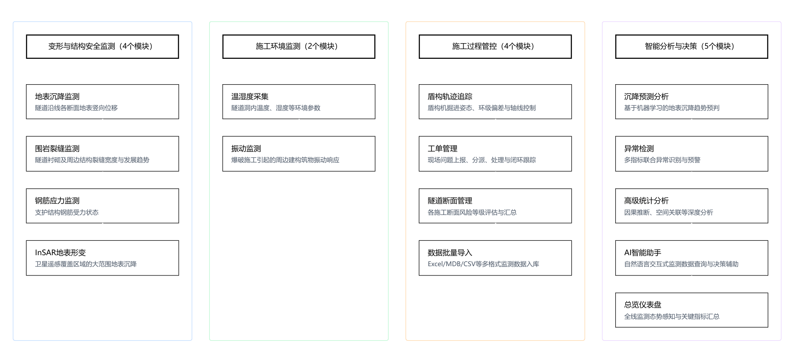

*图7-1 四大功能域与十五模块划分关系图*

系统总体架构采用表现层、业务逻辑层和数据持久层的三层结构，如图7-1所示。表现层面向隧道施工现场的工程师、项目管理人员和数据分析人员，使用React和TypeScript构建单页应用（SinglePageApplication，简称SPA），为上述15个功能模块分别设计了对应的操作界面，并采用懒加载策略——仅在用户访问特定监测功能时才加载对应页面，从而有效控制系统的初始加载时间。业务逻辑层基于Flask搭建，将15个功能模块各自注册为独立的服务单元，每个模块拥有独立的数据处理与接口逻辑，便于针对不同监测业务进行并行开发与独立维护。数据持久层的设计充分考虑了隧道项目的部署场景多样性：云端部署阶段使用Supabase托管的PostgreSQL数据库，通过REST应用程序接口（ApplicationProgrammingInterface，简称API）进行访问；而企业内网或施工现场离线环境下，可通过配置切换至MySQL数据库，两种数据源对上层业务完全透明，切换时无需修改任何业务代码。

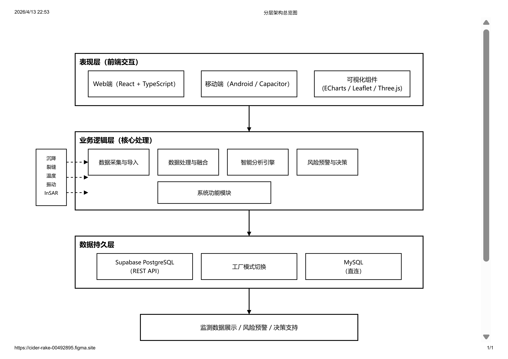

*图7-2 系统总体架构图*

系统的技术选型以隧道工程监测场景的实际需求为导向。界面开发方面，选择React框架的组件化开发模式，使得沉降、裂缝、振动等各监测模块可以作为独立组件分别开发和维护，适合功能模块较多的综合监测平台。后端选择Python语言，主要原因在于隧道监测系统需要集成沉降预测、异常检测、因果推断等多种机器学习（MachineLearning，简称ML）模型，Python在科学计算与机器学习领域具有最为成熟的工具链支持，便于将数据分析算法与监测业务服务进行集成。数据可视化方面，针对隧道监测数据的时序特征和空间分布特点，系统集成了三类可视化引擎：（1）ECharts图表库用于绘制沉降曲线、温度场分布和振动频谱等时序监测图表；（2）Leaflet地图引擎用于InSAR卫星遥感地表形变和隧道线路走向的空间展示；（3）Three.js三维引擎用于隧道结构的数字孪生可视化，支持工程师从三维视角观察隧道线型与变形情况。各类技术选型及其在系统中的具体用途详见表7-1。

*表7-2 系统开发运行环境*

| 类别 | 技术/工具 | 用途说明 |
| --- | --- | --- |
| 前端框架 | React 18 + TypeScript | 组件化监测界面构建与类型安全开发 |
| 构建工具 | Vite | 开发热更新与生产环境打包 |
| UI样式 | Tailwind CSS | 响应式布局与多端适配 |
| 后端框架 | Flask (Python) | RESTful API服务与ML模型集成 |
| 科学计算 | NumPy, SciPy, Pandas | 监测数据预处理与统计分析 |
| 机器学习 | Scikit-learn, PyTorch | 沉降预测、异常检测等智能分析 |
| 云端数据库 | Supabase (PostgreSQL) | 云端监测数据持久化存储 |
| 本地数据库 | MySQL | 施工现场离线数据存储 |
| 部署平台 | Vercel Serverless | 无服务器云端部署 |
| 移动端 | Capacitor | Android移动巡检应用封装 |
| 图表引擎 | ECharts | 沉降曲线、温度场等监测图表 |
| 地图引擎 | Leaflet | InSAR形变与隧道线路空间展示 |
| 3D引擎 | Three.js | 隧道结构三维数字孪生可视化 |
|  |  |  |
|  |  |  |

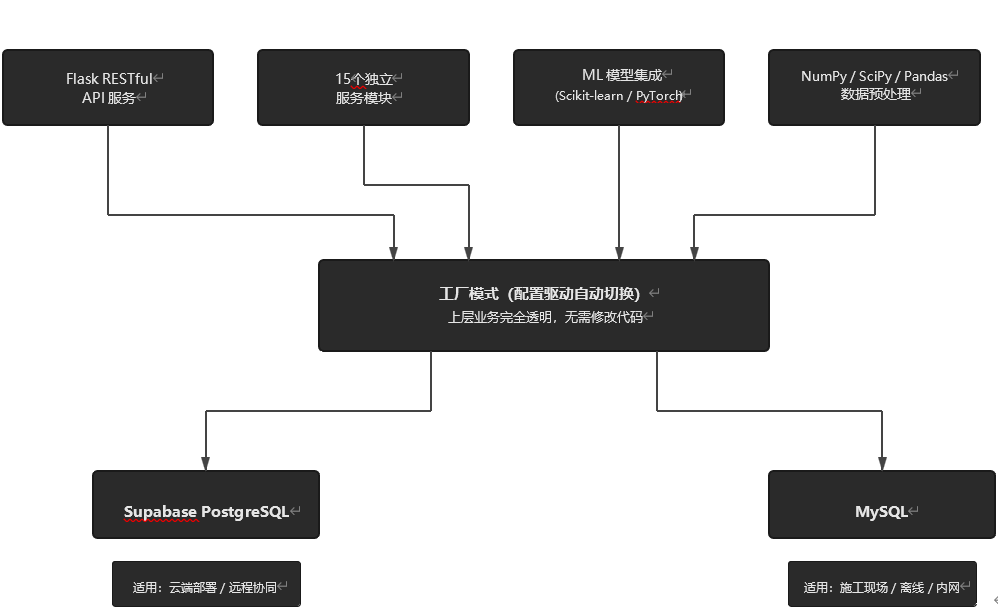

*图7-3 前后端分离三层架构部署图*

隧道监测系统面向的用户角色差异显著：项目管理员负责系统配置与用户管理，现场工程师承担数据录入与分析研判，而上级管理人员主要查阅监测报告与预警信息。针对这一多角色协同需求，系统实现了基于角色的访问控制（Role-BasedAccessControl，简称RBAC）机制。认证上下文模块中定义了管理员（admin）、工程师（user）和访客（guest）三级角色体系，其中管理员拥有用户管理、模块配置、数据删除等全部权限，工程师可使用数据采集、预测分析、工单处理等核心业务功能，访客仅具备数据浏览权限。用户登录后，前端将用户信息存储于全局认证状态中，后续请求自动携带身份标识。在路由层面，权限守卫（AuthGuard）组件负责拦截未认证或权限不足的访问请求，保障隧道监测数据的访问安全。

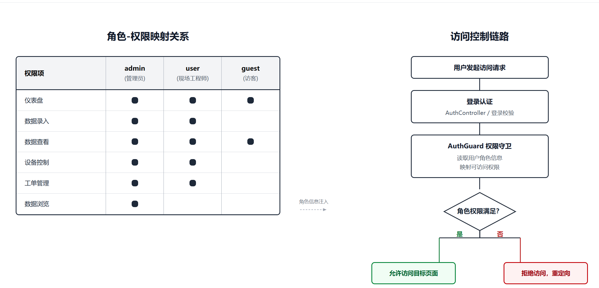

*图7-4 基于角色的访问控制模型图*

前端工程架构的一项重要设计是功能模块的动态管理机制。隧道监测平台的15个功能模块涉及从基础的沉降裂缝数据查看到高级的机器学习预测分析，各模块的开发进度和上线节奏存在差异——例如沉降监测模块在施工初期即需投入使用，而因果推断等高级分析功能可能在积累足够数据后才具备上线条件。为此，系统设计了模块开关控制机制：每个功能模块在后台配置中标记为"已上线"或"待上线"状态，系统在页面加载时自动检查模块状态，已上线模块正常使用，待上线模块则展示"功能开发中"的提示信息。项目管理员可在管理后台随时调整各模块的上线状态，系统记录每次变更的操作时间与操作人，形成审计追踪。此外，考虑到隧道施工现场手持终端与项目办公室大屏的显示差异，系统内置了三档屏幕适配方案（手机、平板和桌面），同一监测数据在不同设备上自动调整为适宜的展示布局。

后端服务的设计重点在于保障隧道施工现场复杂网络环境下系统的可用性。15个功能模块在后端各自拥有独立的数据处理逻辑，沉降分析模块负责断面沉降数据的入库与趋势计算，裂缝监测模块处理裂缝宽度时序数据与扩展速率分析，振动监测模块完成频谱解析与峰值提取，盾构遥测模块管理掘进参数与环级偏差计算，AI助手模块提供自然语言交互式数据查询——各模块独立开发、独立维护，便于根据施工阶段需求灵活扩展。针对隧道施工现场网络条件不稳定的实际问题，系统实现了三级服务保障机制：正常状态下，各监测页面直接请求后端获取实时数据；当网络波动导致请求连续失败时，系统自动判定后端暂时不可达，切换至本地缓存模式，现场工程师仍可查阅已缓存的监测数据与历史分析结果；经过冷却期后系统自动尝试恢复在线连接。对于沉降预测等机器学习推理接口，由于深度学习模型的计算耗时较长，系统为其设置了更宽裕的响应等待时间，避免因计算延迟而误判为服务中断。

系统部署在Vercel平台上，采用无服务器（Serverless）架构实现云端托管。部署配置中将函数最大执行时间设为60秒，主要考虑到隧道沉降预测等机器学习推理接口的计算耗时较长。同时配置了SPA路由重写规则，确保用户直接访问特定监测页面或刷新浏览器时路由系统能正常工作。针对隧道施工现场的移动巡检需求，系统通过Capacitor框架将Web应用封装为Android原生应用，实现了同一代码库同时服务于桌面端监控大屏与移动端现场巡检两种使用场景。移动端通过环境变量检测运行环境，自动切换为适配小屏幕的卡片式布局——桌面端多栏并列显示的监测数据面板在移动端转换为可滑动切换的单栏卡片。整个响应式方案覆盖移动端、平板和桌面三个断点区间，满足隧道工程从施工现场到项目办公室的多场景使用需求。

## 7.2 数据智能采集与融合

隧道施工监测涉及沉降、裂缝、温度、振动等多类物理量的长期连续观测，不同监测项目的数据来源和存储格式差异显著。沉降与裂缝观测通常以电子水准仪或全站仪的测量记录为主，现场导出格式多为Excel表格；温度监测数据来自分布式光纤或电阻式温度传感器，采集仪通常以Access数据库格式集中存储；振动信号由加速度传感器以高采样率实时采集，生成波形文件或数值文件。此外，InSAR卫星遥感技术可提供隧道沿线大范围地表形变信息，其原始数据以矢量地理信息格式存储。上述监测数据在文件格式、采样频率、坐标体系和时间基准等方面存在明显差异，如何将分散在不同设备和文件中的监测记录统一汇集至同一平台，是隧道监测信息化建设面临的基础性问题。本节从批量数据导入、文件上传管理、InSAR遥感数据处理和数据存储层设计四个方面，阐述系统的数据采集与融合实现方案，其总体流程如图7-5所示。

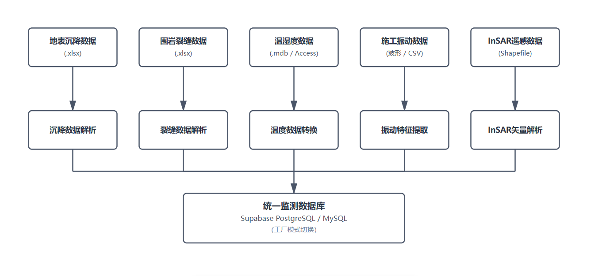

*图7-5 多源数据采集与融合流程图*

针对隧道施工现场长期积累的大量历史监测记录，系统设计了覆盖四类监测数据的批量导入功能，各数据类型的格式特征与处理方式如表7-2所示。（1）沉降数据导入功能接收Excel格式的水准测量记录，将首列统一识别为测量日期，其余各列对应各监测断面的累计沉降量，系统逐行解析后写入沉降数据库。（2）裂缝数据导入同样读取Excel文件，但由于裂缝监测的测点数量在施工过程中可能随开挖进展动态增减，系统可自动识别新增的监测点并扩展数据表结构，同时自动过滤汇总统计行以保证原始观测数据的完整性。（3）温度数据通常存储于振弦式传感器配套的Access数据库中，系统连接该数据库后，按传感器类型自动筛选温度通道记录，将传感器输出的原始电阻值换算为温度值后批量写入系统数据库，单次处理规模可达五万条记录，满足大规模温度监测网络的数据汇入需求。（4）振动数据通过专用上传接口导入，系统解析波形文件后保留完整的频域与时域特征信息，为后续振动频谱分析和爆破振动评估提供数据基础。

*表7-2 系统支持的数据源类型及处理方式*

| 数据类型 | 文件格式 | 处理要点 | 目标存储 |
| --- | --- | --- | --- |
| 沉降监测 | Excel (.xlsx/.xls) | 自动识别测量日期列，按断面解析累计沉降量 | 沉降原始数据表 |
| 裂缝监测 | Excel (.xlsx/.xls) | 支持测点动态增减，自动过滤统计汇总行 | 裂缝监测数据表 |
| 温度监测 | Access (.mdb/.accdb) | 按传感器类型筛选温度通道，电阻值-温度换算 | 温度监测数据表 |
| 振动监测 | 波形文件/CSV | 保留频域与时域特征，关联数据集-通道-特征 | 振动数据表组 |
| InSAR遥感 | Shapefile (.shp) | 坐标转换、聚类分区、时序提取 | 磁盘缓存 |
|  |  |  |  |

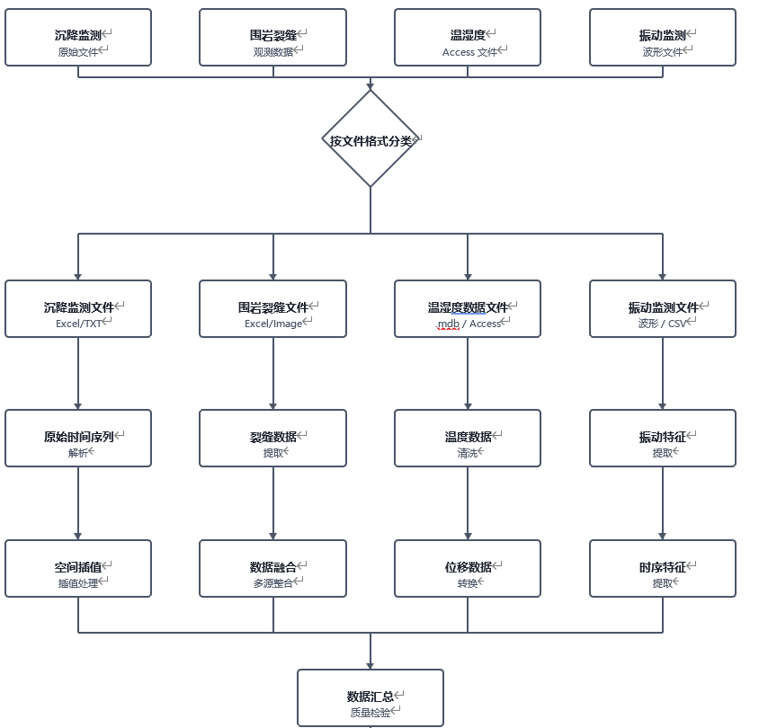

*图7-6 多格式批量导入处理流程图*

文件上传环节的设计兼顾了施工现场操作的便捷性与数据安全性。系统为沉降、裂缝、温度、振动四类监测数据分别提供了独立的上传入口，各入口仅接受对应格式的文件，避免格式混淆导致解析错误。单个文件大小限制为10MB，上传过程中系统对文件名进行安全检查，防止恶意文件对服务器造成影响。考虑到隧道监测数据文件通常包含数千至数万条观测记录，解析和入库耗时较长，若等待处理完毕再响应会影响现场人员的操作体验。为此，系统在文件上传成功后立即向用户反馈确认信息，数据解析与入库在后台自动完成，用户可随时查询导入进度，处理完成后系统主动提示。这一设计确保现场工程师在数据导入期间仍可继续使用平台的其他监测功能。

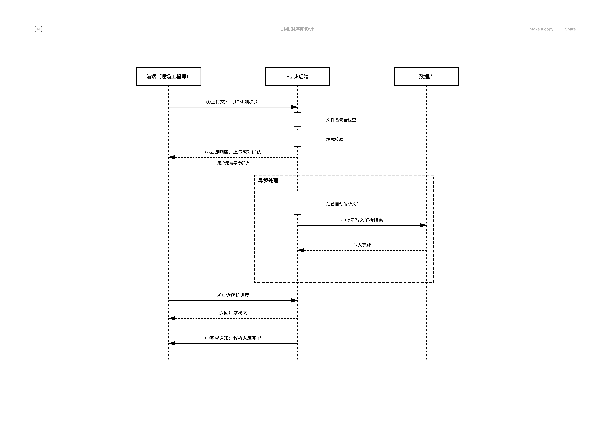

*图7-7 异步文件上传与后台处理时序图*

InSAR卫星遥感数据的处理流程相较常规监测数据更为复杂。在隧道工程中，InSAR技术主要用于获取隧道沿线及周边区域的地表形变场信息，其观测范围可覆盖数平方千米区域，单次处理涉及数千至数万个地面散射点的位移时间序列。系统针对InSAR数据设计了三步处理流程：第一步为矢量数据解析，系统读取Shapefile格式的InSAR处理成果，自动识别其中的形变速率或累计位移字段，并将坐标统一转换为经纬度地理坐标，转换后的数据以标准化格式供地图组件在浏览器中渲染显示。第二步为空间聚类分区，系统采用DBSCAN密度聚类算法将地理位置相近的散射点自动分组——该算法以50米为邻域搜索半径，要求每组至少包含6个散射点方可构成有效聚类。聚类完成后，各组按形变速率划分为危险沉降区、预警沉降区、危险隆起区和预警隆起区四个等级，并自动生成各区域的边界轮廓，在地图上以不同颜色直观标示各风险区域的空间范围与等级，便于工程管理人员快速识别需要重点关注的地段。第三步为位移时间序列提取，系统从原始数据中识别各期卫星观测对应的位移数据列，按时间顺序排列后形成各散射点的形变演化曲线，为判断地表沉降趋势是否收敛提供依据。上述三步处理的结果通过磁盘缓存保存，同一批次的InSAR数据无需重复解析，提高了多次查阅时的响应速度。

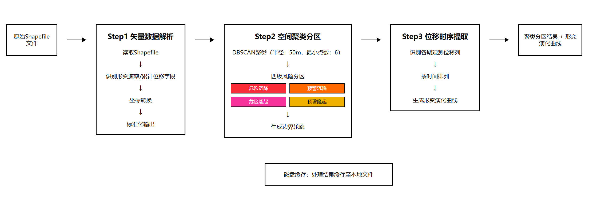

*图7-8 InSAR遥感数据三步处理工作流图*

数据存储层的设计充分考虑了隧道项目在不同阶段的部署环境差异。在系统开发与云端测试阶段，监测数据存储于Supabase托管的PostgreSQL云数据库中，工程技术人员通过浏览器即可随时访问各类监测数据，便于远程协同分析。当系统部署至施工现场局域网或不具备外网条件的离线环境时，可切换至本地MySQL数据库，全部监测数据存储在现场服务器上，不依赖外部网络即可运行完整的监测功能。两种部署模式的切换对上层功能完全透明——系统启动时根据配置自动选择对应的数据库连接方式，所有监测分析功能无需任何调整即可正常使用。这一设计使得同一套系统可在云端原型验证和施工现场生产运行之间灵活切换，降低了隧道项目跨阶段部署的实施成本。

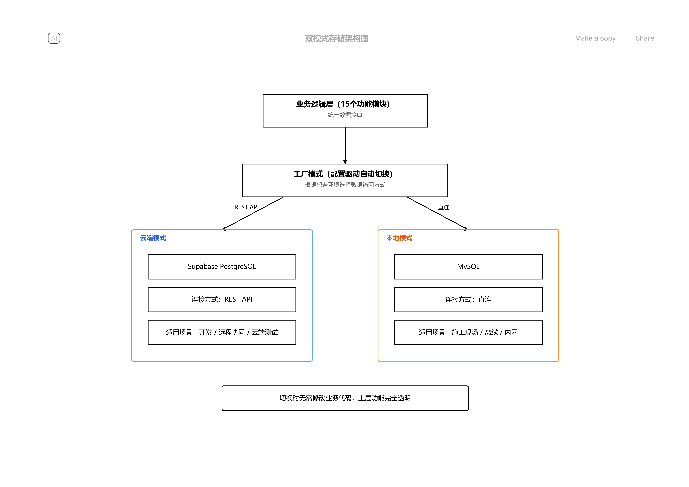

*图7-9 云端与本地双模式存储架构图*

综上，系统通过四类批量导入功能、异步文件上传机制、InSAR三步处理流程和双模式数据存储方案，实现了对隧道施工监测中沉降、裂缝、温度、振动及InSAR遥感等五类监测数据的统一采集与融合管理。各类数据经过格式解析、质量过滤和标准化处理后汇入统一的数据库，为后续的智能分析与风险预警提供了规范化的数据基础。

## 7.3 智能分析与AI决策

隧道施工监测积累的大量沉降、裂缝、温度和振动数据，蕴含着围岩变形演化、支护结构受力变化和施工扰动传播等重要工程信息。然而，仅凭人工经验逐一比对数据曲线来发现潜在风险，既效率有限又容易遗漏关键异常。将机器学习与数据驱动分析方法引入隧道监测体系，能够从海量历史观测中自动提取变形规律、识别异常模式并预测未来趋势，为施工决策提供定量化的技术支撑。本节从机器学习模型的部署策略、预测分析链路、异常检测引擎、高级分析功能、风险预警机制和AI智能助手六个方面，系统阐述智能分析模块的设计与实现方案。

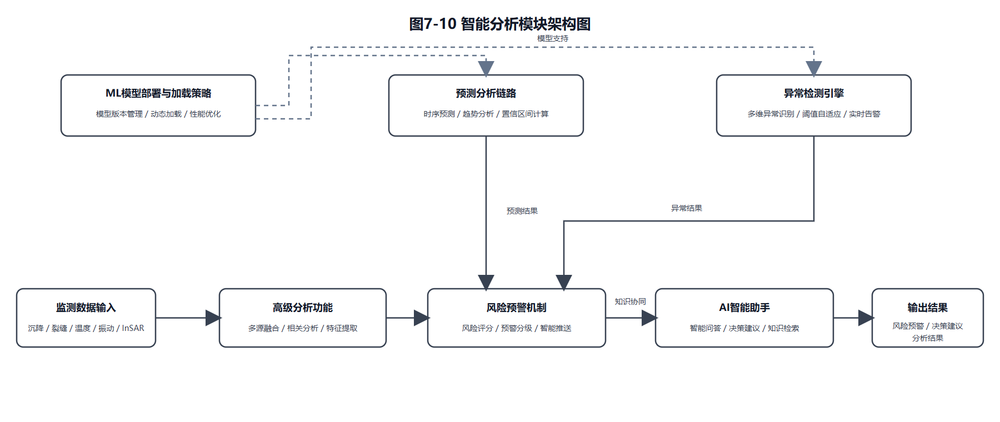

*图7-10 智能分析模块架构图*

### 一、机器学习模型部署与轻量化替代策略

隧道监测智能分析功能依赖多种机器学习模型的协同运行，包括时序预测模型、异常检测模型、因果推断模型和可解释性分析模型等。在传统的服务器部署环境下，上述模型可通过预装完整的Python科学计算库（PyTorch、TensorFlow等）直接加载运行；然而，本系统采用Vercel Serverless无服务器架构部署后端服务，该架构对运行环境施加了严格的资源约束——单个函数的内存上限为1024MB，最长执行时间为60秒，且冷启动时需要在短时间内完成所有依赖库的加载。若在服务启动时一次性导入全部深度学习框架和模型文件，仅PyTorch一项即超过500MB，将直接导致内存溢出或启动超时。

针对上述部署约束，系统设计了"条件导入—轻量替代—Mock降级"三级自适应加载策略。第一级为条件导入机制：系统在启动阶段不加载任何机器学习库，而是为每类模型设置独立的可用性标志，共计11个布尔标志分别对应Prophet时序预测、Informer长序列预测、STGCN时空图卷积、PINN物理信息神经网络、Ensemble集成学习、轻量替代模块、SHAP可解释性、Neo4j图数据库、Supabase知识图谱、因果推理引擎和知识图谱问答等模型组件。只有当用户实际调用某项分析功能时，系统才在对应的API路由处理函数内部尝试导入所需库，导入成功则将相应标志置为True，导入失败则置为False并转入下一级策略，整个过程对用户完全透明。第二级为轻量替代策略：当PyTorch等重型框架无法加载时，系统自动启用基于Scikit-learn的轻量化替代实现。具体而言，Informer模型的替代方案采用梯度提升回归器配合1至7阶滞后特征构建时序预测能力；STGCN的替代方案采用随机森林回归器，通过引入5个最近邻监测点的观测值作为空间特征来模拟图卷积的空间信息聚合效果；PINN的替代方案将梯度提升回归器的数据驱动预测结果与基于Terzaghi一维固结理论计算的物理约束项进行加权融合，通过可调节的物理权重参数平衡数据拟合与物理规律之间的关系；Ensemble集成学习的替代方案则组合梯度提升、随机森林和二次多项式回归三个基学习器，以加权平均方式输出最终预测值。上述轻量替代模型均保持与原始深度学习模型相同的输入输出接口，上层调用代码无需任何修改即可无缝切换。第三级为Mock降级：当运行环境极度受限、连Scikit-learn基础库也无法正常加载时，系统采用随机数生成器在合理的工程数值范围内构造模拟结果，并在返回数据中附加"mock:true"标志，前端界面据此提示用户当前结果仅供参考而非真实模型推理输出，确保系统在任何部署环境下均不会因模型加载失败而中断服务。

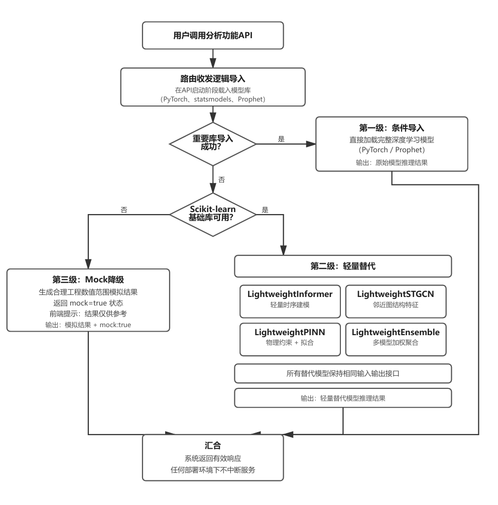

*图7-11 机器学习模型三级自适应加载策略图*

### 二、预测分析全链路

沉降预测是隧道施工监测中最核心的分析需求之一，工程人员需要根据已有的累计沉降观测数据，预判未来7至30天内各监测断面的沉降发展趋势，从而为支护参数调整和施工进度安排提供前瞻性依据。系统为此构建了从前端请求发起、后端模型自动选择到预测结果返回的完整链路。

预测链路的核心在于模型自动选择机制。不同监测点的沉降时间序列具有不同的数据特征——有的序列数据量充足且呈现明显的季节性波动，适合采用Prophet等分解模型；有的序列较短且趋势单一，简单的线性回归即可获得良好拟合效果；还有的序列波动剧烈、非平稳性显著，则需要ARIMA等差分模型来处理。人工逐点选择模型既不现实也容易引入主观偏差。为此，系统实现了四步自动选择流程：第一步为数据特征分析，模型选择器从输入时间序列中提取6个统计特征，包括数据长度、趋势强度（以线性拟合的决定系数R²衡量）、波动程度（以变异系数衡量）、季节性强度、平稳性和离群值比例，这些特征从不同维度刻画了时间序列的结构特点。第二步为规则推荐，系统根据上述特征给出初始模型建议——当数据量少于30条时推荐线性回归以避免过拟合，当波动程度较高时推荐ARIMA模型以捕捉非平稳动态，当数据量充足（100条以上）且存在周期性时推荐Prophet模型以发挥其趋势分解优势。第三步为实证评估，系统将历史数据按8:2比例划分为训练集和测试集，在规则推荐的候选模型以及线性回归、ARIMA、SARIMA、Prophet四类基础模型上逐一进行回测，计算各模型在测试集上的预测误差。第四步为贪心选择，系统以平均绝对误差（MAE）为默认评价指标，选取误差最低的模型作为该监测点的最优预测模型，并将选择结果缓存至本地文件，后续对同一监测点的重复预测请求可直接复用已选模型而无需重复评估，提高了响应效率。

整个预测链路的调用流程如下：前端页面发起预测请求时，将监测点编号、预测步长和评价指标作为参数传递至后端API接口；后端首先从数据库获取该监测点的历史沉降序列，随后调用模型选择器执行上述四步流程完成模型选择与训练；最终返回的预测结果包含未来各日期的预测值、置信区间上下界以及模型选择的详细信息（包括各候选模型的评估得分），便于工程人员了解预测依据并评判结果的可信度。

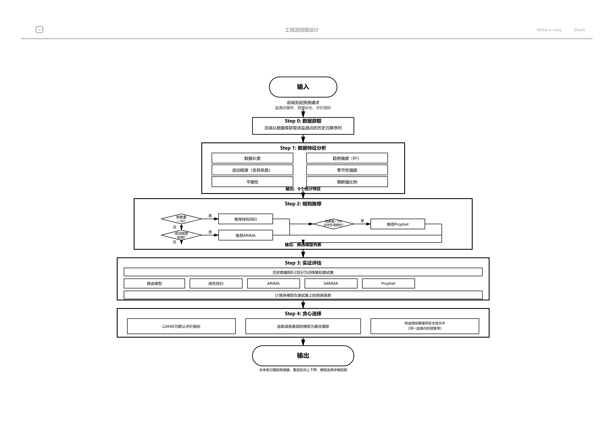

*图7-12 沉降预测四步模型自动选择流程图*

### 三、异常检测引擎

隧道施工期间，监测数据中偶发的异常波动往往是围岩失稳、支护变形或施工扰动等工程风险的前兆信号。及时识别这些异常并判断其严重程度，对于预防安全事故具有重要意义。然而，沉降监测网络通常包含数十个测点，每个测点每日产生一条以上的观测记录，依靠人工逐一审查全部数据曲线来发现异常既耗时又容易遗漏。为此，系统构建了基于多维特征工程与双模型协同的自动异常检测引擎。

异常检测的第一步是将原始的一维沉降时间序列扩展为多维特征向量，以便从不同角度刻画数据的变化模式。系统对每个监测点的历史观测序列提取8个特征维度：（1）累计沉降值，反映测点当前的绝对变形状态；（2）日沉降速率，即相邻两次观测值的一阶差分，反映变形发展的即时速度；（3）7日移动平均值，用于平滑短期波动、揭示近期变形趋势；（4）7日滚动标准差，衡量近期观测值的离散程度，标准差越大说明数据波动越剧烈；（5）加速度，即日沉降速率的一阶差分（原始值的二阶差分），反映变形速度是否在加快或减缓；（6）偏离均线程度，定义为当前观测值与7日移动平均值之差，用于检测突然偏离正常趋势的观测值；（7）14日移动平均值，作为中长期趋势的参考基线；（8）趋势差，定义为7日移动平均与14日移动平均之差，当短期均线显著偏离长期均线时，提示变形趋势可能发生转折。上述8个特征从绝对值、变化速度、波动性、加速度和趋势偏离等多个层面构建了对沉降行为的全面描述，为后续的异常模式识别提供了丰富的判别信息。

在特征工程的基础上，系统采用Isolation Forest（孤立森林）和LOF（局部离群因子）两种无监督学习模型协同进行异常检测。孤立森林算法通过随机选择特征和分割点递归划分数据空间，异常样本由于偏离多数数据分布，通常只需较少的分割次数即被"孤立"出来，分割次数越少则异常程度越高。系统配置孤立森林使用100棵决策树，预设污染率为5%（即假定数据中约有5%的观测存在异常），随机种子固定为42以保证结果可复现。LOF算法则从局部密度的角度评估异常，它计算每个样本与其近邻的密度比值，若某样本所在区域的密度显著低于其邻域，则判定为离群点，系统将LOF的近邻数设为20，同样以5%的污染率运行。两种模型从不同的数学原理出发——孤立森林侧重全局分布的孤立性判断，LOF侧重局部密度的相对偏离——对同一数据集进行独立检测，综合两者的结果可以提高异常识别的鲁棒性，降低单一模型可能带来的误检或漏检风险。

检测到异常后，系统进一步对异常严重程度和类型进行分级分类。严重度分级基于异常分数的百分位数：异常分数位于全部异常样本前25%的判定为"危急"级别，25%至50%之间为"高"级别，50%至75%之间为"中等"级别，其余为"低"级别。异常类型的分类则依据8维特征中的关键指标：当日沉降速率绝对值超过0.5时，判定为"突变型"异常，提示可能发生了突发性地层变形；当加速度绝对值超过0.2时，判定为"加速型"异常，表明沉降速度正在持续加快；当7日滚动标准差超过0.3时，判定为"波动型"异常，说明观测数据出现了不规则的剧烈震荡；当偏离均线程度超过1.0时，判定为"趋势偏离型"异常，意味着当前变形行为已显著偏离近期的正常演化轨迹。上述分级与分类结果以结构化数据形式返回前端，在异常扫描仪表盘中按红色（危急）、橙色（高）、黄色（中等）和绿色（正常）四级颜色直观展示各监测点的健康状态，帮助工程管理人员在数十个监测点中快速锁定需要优先处置的异常区域。

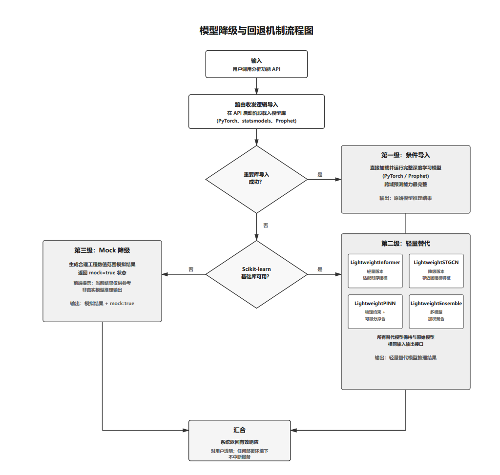

*图7-13 多维特征工程与双模型协同异常检测流程图*

### 四、高级分析功能模块

除基础的预测与异常检测外，隧道工程监测还需要从更深层次揭示变形的驱动因素和空间传导规律，为工程决策提供多维度的分析支撑。系统将多种高级分析功能集成于统一的分析工作台页面中，按照"发现问题—预测趋势—追溯原因—综合研判"的分析逻辑，将10个分析面板组织为5个功能组，形成从异常发现到决策建议的完整分析闭环。

第一组为问题发现，包含异常扫描仪表盘和处置建议面板。异常扫描仪表盘一次性对全部25个监测点执行批量异常检测，按上述四级颜色标注每个测点的异常状态和严重等级，并自动统计各等级的点位数量，使工程人员可在一个视图内总览全场监测网络的整体健康状况。处置建议面板则针对已识别的异常，基于异常类型和严重程度自动生成相应的处置方案建议，辅助现场管理人员制定应急响应措施。

第二组为趋势预测，包含常规预测仪表盘和深度学习预测仪表盘。常规预测仪表盘调用前述模型自动选择链路，为指定监测点生成7至30天的沉降预测曲线及其置信区间。深度学习预测仪表盘则专门调用Informer、STGCN和PINN三类深度学习模型（或其轻量替代版本），展示不同模型架构在长期预测任务上的表现差异，便于研究人员对比评估各模型在特定工程场景下的适用性。

第三组为根因追溯，包含因果分析仪表盘和可解释性分析仪表盘。因果分析仪表盘整合了两项功能：其一为因果推断分析，系统基于施工事件日志与沉降时间序列的时间对应关系，采用事件前后对比方法评估特定施工活动（如爆破开挖、注浆加固等）对监测数据的影响程度；其二为空间关联分析，系统计算各监测点之间沉降序列的相关系数矩阵，识别空间上变形联动的测点群组，揭示地层变形的空间传导路径。可解释性分析仪表盘基于SHAP（SHapley Additive exPlanations）方法，对预测模型的输出进行特征重要性分解，以可视化的方式展示哪些输入特征对预测结果的贡献最大，增强模型预测的可解释性和工程可信度。

第四组为综合研判，以知识图谱仪表盘为核心。该仪表盘基于NetworkX图计算库构建隧道监测领域的内存知识图谱，图中的节点代表各监测点，边代表监测点之间的空间近邻关系和统计相关性。通过图查询可以快速检索指定监测点的邻域影响范围、追踪因果传导链路以及筛选高风险节点群组。知识图谱还支持文档管理功能，工程人员可将地质勘察报告、设计变更通知等工程文档录入系统，通过知识图谱问答接口以自然语言提问的方式检索相关信息，实现监测数据与工程文档的知识融合。

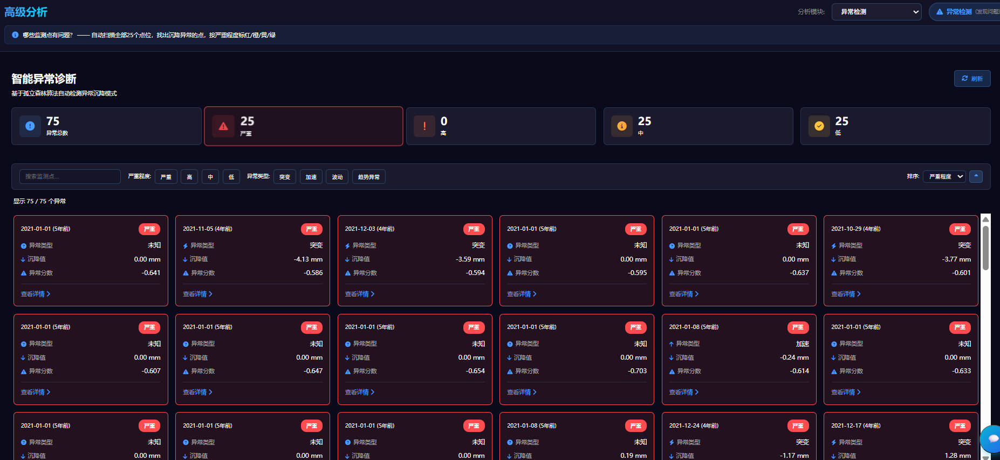

*图7-14 高级分析工作台五组功能面板组成图*

### 五、风险预警与自动告警机制

智能分析的最终目标是将模型输出的数值结果转化为工程人员可直接响应的风险预警信息。系统建立了以沉降预测和异常检测结果为核心数据源的风险预警机制，通过多维度信息聚合与量化评分，实现对各监测点风险等级的自动研判与分级告警。

风险预警的生成流程如下：系统首先汇总全部监测点的预测分析结果，将每个点位的未来沉降预测值与预设的工程控制阈值进行比较，同时综合该点位近期的异常检测结果（包括异常频次、最高严重等级和异常类型分布）、空间关联异常情况（相邻点位是否同步出现异常）以及历史变形趋势特征（沉降速率是否持续增大），按权重计算得到一个量化的风险评分。根据风险评分的高低，系统将各监测点划分为"危急""高风险""中风险"和"低风险"四个等级，其中危急和高风险等级的监测点将被纳入告警列表，按风险评分从高到低排序后推送给工程管理人员。告警信息包含监测点编号、当前累计沉降值、预测未来变形量、触发告警的具体原因以及建议的应急处置措施，使管理人员在接收告警后能够快速了解风险详情并做出响应决策。该预警机制将原本分散在预测、异常检测和空间分析等不同功能模块中的分析结果进行了有机整合，避免了工程人员在多个分析界面之间来回切换查找信息的低效操作，实现了从"数据→分析→预警→决策建议"的完整闭环。

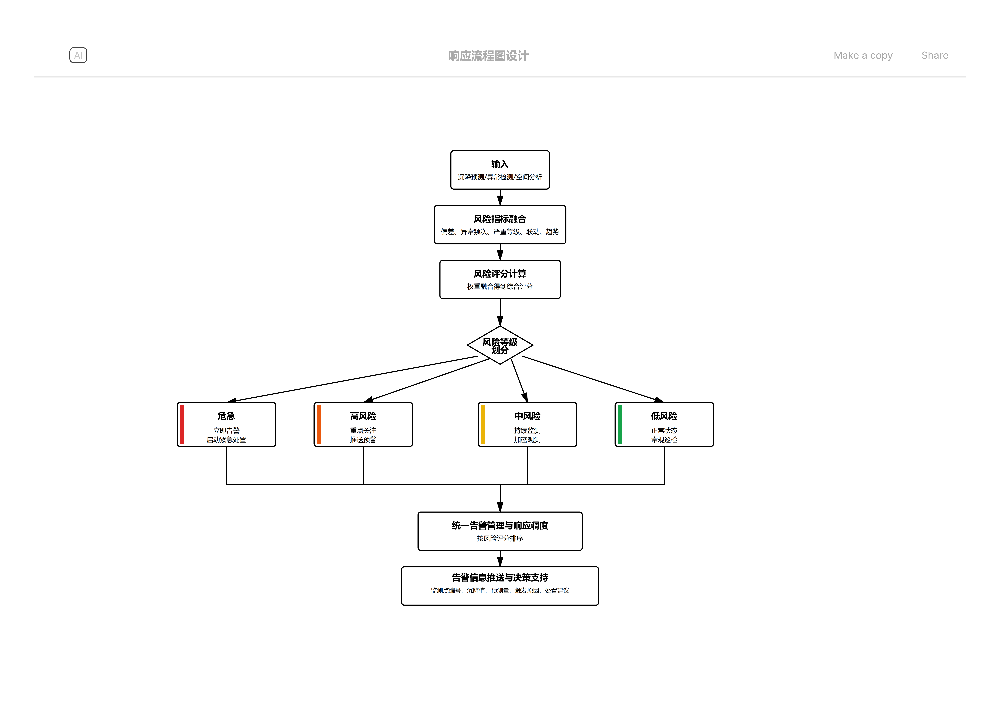

*图7-15 风险预警与多级自动告警流程图*

### 六、AI智能助手

面对系统提供的众多分析功能和海量监测数据，不同专业背景和技术水平的用户在使用系统时可能面临操作路径不清晰、分析结果难以解读等问题。为降低智能分析功能的使用门槛，系统集成了基于大语言模型的AI智能助手，用户可通过自然语言对话的方式查询监测数据、调用分析功能和获取工程建议，无需逐一记忆各分析模块的操作入口和参数设置。

AI助手的核心采用ReAct（Reasoning and Acting）推理框架实现。ReAct框架将大语言模型的推理过程结构化为"思考—行动—观察"三步循环：在每一轮迭代中，模型首先分析用户意图并推理当前应采取的行动（思考阶段），随后调用相应的数据查询或分析工具执行具体操作（行动阶段），最后根据工具返回的结果进行判断，决定是否需要继续调用其他工具或直接生成最终回复（观察阶段）。系统为ReAct引擎配备了16个专用工具，覆盖监测数据查询（监测点列表查询、沉降数据查询、温度数据查询、裂缝数据查询）、智能分析调用（异常检测、沉降预测、相关性分析、异常批量查询）、知识图谱操作（知识图谱构建与查询、知识图谱问答）以及辅助功能（施工事件查询、温度风险评估、温度处置方案、分析摘要查询、学术文献检索）等四大类能力，使助手能够在对话过程中动态调用系统的各项分析功能获取实时数据，而非仅依赖语言模型的静态知识作答。考虑到Serverless环境的执行时间限制，系统将ReAct循环的最大迭代次数设为2次，单次请求的硬超时设为45秒，工具返回结果超过2000字符时自动截断并保留最重要的前5条记录，从而在推理深度与响应速度之间取得平衡。

*图7-16 AI助手ReAct推理流程图*

为提高意图识别的效率，系统在ReAct推理之前设置了基于关键词和正则表达式的意图预分类层。该分类器根据用户输入中出现的领域关键词（如"沉降""裂缝""温度""预测""异常"等）和句式模式，将用户意图快速路由至对应的功能类别，并据此将传递给大语言模型的可用工具集从全部16个缩减至与当前意图最相关的1至5个。这一设计显著减少了大语言模型在工具选择阶段需要处理的候选项数量，降低了Token消耗和选择错误的概率，加快了推理响应速度。

在用户交互层面，AI助手以浮动按钮的形式常驻于系统界面右下角，点击后展开对话面板，支持多轮上下文连续对话。助手的响应采用SSE（Server-Sent Events）流式传输技术实现，后端在推理过程中将思考步骤、工具调用进展和最终回复文本以事件流的形式逐步推送至前端浏览器，用户可以实时观察助手的推理过程——包括当前正在调用哪个分析工具、工具返回了什么中间结果——而非等待全部处理完成后才看到一次性的最终回复。流式传输共定义了5种事件类型：thinking（展示当前推理步骤）、tool_start（提示开始调用某工具）、tool_end（展示工具执行结果摘要）、text_delta（增量输出回复文本）和done（标记响应结束），整个推理过程对用户完全可见，增强了人机交互的透明度和用户对分析结果的信任感。

### 七、本节小结

综上所述，系统的智能分析模块围绕隧道施工监测的实际需求，构建了从模型部署到风险预警的完整技术体系。三级自适应加载策略（条件导入—轻量替代—Mock降级）解决了无服务器架构下机器学习模型的部署难题，使系统在云端受限环境和本地完整环境中均能提供智能分析服务。四步模型自动选择流程将模型评估与选择过程标准化，免除了人工逐点选模型的繁琐操作。基于8维特征工程和双模型协同的异常检测引擎实现了对多类异常模式的自动识别与分级预警。涵盖异常扫描、趋势预测、因果分析、可解释性和知识图谱的高级分析工作台为工程决策提供了多维度的技术支撑。基于ReAct框架和SSE流式传输的AI智能助手降低了复杂分析功能的使用门槛，使不同技术背景的用户均能通过自然语言对话便捷地获取监测数据分析结果。上述各模块相互协同，共同构成了面向隧道施工安全监测的数据驱动智能决策支持体系，系统集成的主要机器学习模型及其功能定位如表7-3所示。

*表7-3 系统集成的机器学习模型清单*

| 模型名称 | 功能定位 | 轻量替代方案 |
| --- | --- | --- |
| Prophet | 时序分解与趋势预测 | ExponentialSmoothing（指数平滑） |
| ARIMA/SARIMA | 非平稳序列差分预测 | —（原生Scikit-learn实现） |
| Informer | 长序列时序预测 | GradientBoosting+滞后特征 |
| STGCN | 时空图卷积多点联合预测 | RandomForest+近邻空间特征 |
| PINN | 物理信息约束神经网络 | GradientBoosting+Terzaghi物理项 |
| Ensemble | 多模型集成学习 | GB+RF+多项式加权平均 |
| Isolation Forest | 基于孤立性的异常检测 | —（原生Scikit-learn实现） |
| LOF | 基于局部密度的异常检测 | —（原生Scikit-learn实现） |
| SHAP | 模型可解释性分析 | —（依赖原生SHAP库） |
| NetworkX知识图谱 | 监测点空间关系与知识融合 | —（纯Python图计算） |

## 7.4 集群控制与远程管控

隧道暗挖施工涉及掘进、支护、监测、物料调配等多道工序的协同推进，管理链条长、参与角色多、作业空间分散，工程师需在掌子面进行现场巡检，项目经理在办公室审阅监测报告，数据分析人员则在远端开展深度研判。这种多层级、多场景的协同模式，要求监测平台不仅能被动地展示数据，还需主动驱动施工管控流程的闭环运转。然而，传统的隧道监测系统多采用单向数据流模式，工程师发现沉降异常后仍需通过电话或纸质工单通知现场处理，问题跟踪依赖人工记录，处置进度难以量化，难以满足暗挖施工对快速响应和多方协同的管理要求。针对上述问题，本节围绕"集群控制与远程管控"这一主题，从移动端跨平台适配与现场巡检、施工问题工单管理、三维数字孪生可视化、盾构掘进轨迹偏差管控、项目态势总览与智能诊断以及隧道断面风险分级管控六个方面，阐述系统在远程管控层面的设计与实现方案。各功能模块在设计上均遵循"感知—研判—指令—反馈"的管控闭环理念，力求将监测数据的价值转化为可操作的施工管控指令，推动隧道施工现场管理从被动响应向主动干预转变。

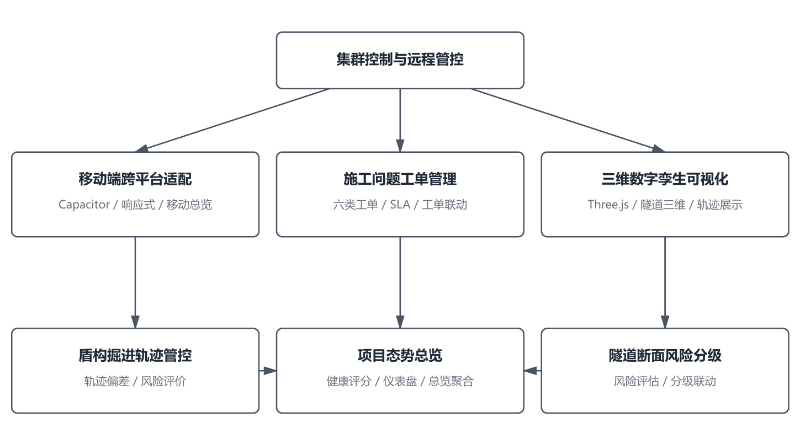

*图7-17 集群控制与远程管控功能模块关系图*

### 一、移动端跨平台适配与现场巡检

隧道施工现场的移动巡检是远程管控体系的重要环节。工程师在洞内进行日常巡检时，需要随时查看监测点的实时数据、接收预警通知并上报现场问题，而传统的桌面端监测界面在手持终端上的操作体验较差，无法满足移动作业场景下数据查阅与问题反馈的使用需求。为解决这一问题，系统采用Capacitor跨平台框架将Web应用封装为Android原生应用，实现了同一套前端代码库同时服务于桌面端监控大屏与移动端现场巡检两种使用场景。在界面适配方面，系统根据终端屏幕尺寸自动切换布局模式：（1）桌面端采用基于react-grid-layout的磁贴式仪表盘布局，多个监测数据面板以网格形式排布，工程师可根据关注重点自由拖拽调整面板位置，适用于办公室环境下的多维度数据综合研判；（2）移动端自动切换为卡片滑动模式，将各监测面板转化为可逐一切换的独立卡片，每次仅展示一个数据面板，在小屏幕设备上提供清晰的数据阅读体验，适用于洞内光线不足、单手持握等现场操作条件。整套响应式方案覆盖手机、平板和桌面三个终端类型，确保隧道工程从施工现场到项目办公室的多场景使用需求均可得到满足。

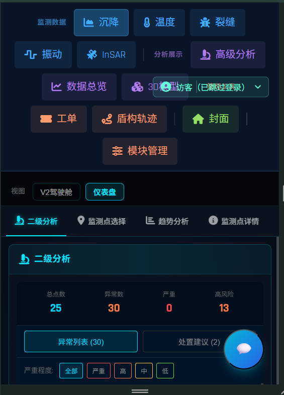

*图7-18 移动端跨平台适配与响应式布局切换示意图*

### 二、施工问题工单管理

隧道施工过程中，地表沉降超限、结构裂缝扩展、监测设备故障等现场问题的及时发现、分派处理与闭环确认，是保障施工安全的关键管理环节。传统的问题处置方式依赖电话通知或纸质记录，不仅难以追溯处理进度，而且在多个问题并发时容易出现遗漏。为实现施工问题的全流程数字化管控，系统设计了一套工单管理子系统，定义了六种与隧道监测业务紧密对应的工单类型，并为每种类型设置了基于服务等级协议（Service Level Agreement，简称SLA）的基准响应时限：（1）沉降预警工单，用于处理地表沉降量超限或沉降速率异常等紧急情况，基准响应时限为2小时；（2）裂缝预警工单，对应新增裂缝或裂缝宽度扩展等结构安全问题，基准响应时限为3小时；（3）设备故障工单，涵盖传感器失灵、数据采集仪中断等监测硬件问题，基准响应时限为4小时；（4）巡检任务工单，支持监测点定期巡检和设备状态检查等周期性现场核查，基准响应时限为8小时；（5）数据分析工单，用于安排沉降趋势分析、关联性分析等深度数据研判任务，基准响应时限为12小时；（6）维护保养工单，涵盖传感器校准、零部件更换等计划性维护作业，基准响应时限为24小时。上述SLA基准时限并非固定不变，系统引入了优先级动态调整机制：紧急优先级的工单将基准时限压缩至50%，高优先级按75%计算，中优先级保持基准不变，低优先级则放宽至150%。这种分类分级的响应时限计算方式，使得沉降超限等紧急安全问题能够获得最高优先处置，而计划性维护等非紧急任务则允许在更充裕的时间窗口内完成。

工单从创建到关闭的全过程通过六个状态进行管控，如图7-19所示。工单创建后进入"待处理"状态，系统根据工单类型自动分派给对应角色的处理人——沉降预警和裂缝预警类工单分配给监测工程师，设备故障和巡检任务类工单分配给现场技术员，数据分析类工单分配给数据分析人员。处理人接单后工单流转至"处理中"状态；若处理过程中因等待配件到货或需要上级审批等原因暂时无法继续推进，可将工单挂起至"已挂起"状态，条件满足后恢复处理。问题解决后工单进入"已解决"状态，系统自动通知工单创建人进行确认；创建人确认无误后工单关闭，若认为问题未彻底解决则可将工单退回要求继续处理。此外，对于明确属于无效报告或重复提交的工单，管理人员可将其标记为"已拒绝"。每一次状态流转均受到角色权限的约束，避免越权操作导致的管理混乱。

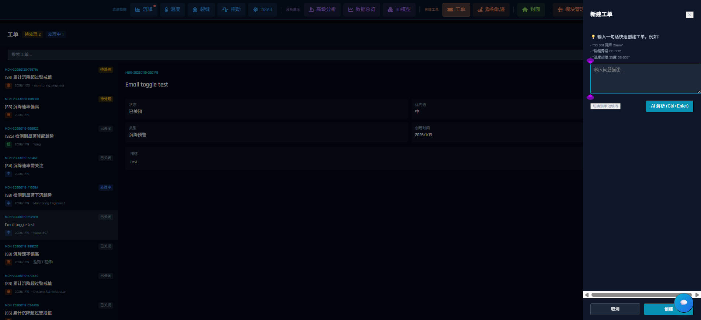

*图7-19 工单生命周期状态转换图*

在工单创建环节，系统针对施工现场操作效率的实际需求，实现了基于自然语言处理（Natural Language Processing，简称NLP）的快捷输入功能。现场工程师在手持终端上可直接输入简短的自然语言描述，系统通过关键词匹配自动识别其中的监测点编号，并根据文本语义自动推断工单类型和优先级，将工单创建时间从传统表单填写的数分钟缩短至数十秒，显著提升了现场问题上报的时效性。在工单跟踪方面，系统部署了后台定时调度服务，周期性执行三项操作：扫描即将到期的工单并向处理人发送提醒通知；检查已超过SLA时限的逾期工单并向处理人和管理人员同时发送告警；将已关闭超过7天的工单自动归档以保持管理界面简洁。通知服务基于SMTP协议实现，支持SSL加密连接，覆盖工单创建、即将到期和已逾期三类通知场景。值得注意的是，工单系统与前文所述的预警分析模块实现了联动——当异常检测引擎识别到沉降指标触发报警阈值时，系统自动创建对应类型的工单并分派至责任人，无需人工介入即可启动问题处置流程，实现了从"监测数据异常感知"到"施工管控指令下达"的全自动闭环。

### 三、三维数字孪生可视化

隧道结构的三维数字孪生可视化是帮助工程师直观理解隧道线型与变形情况的重要手段。与传统的二维断面图和平面展布图相比，三维模型能够同时呈现隧道纵向走势、横断面轮廓和局部变形特征之间的空间关系，便于工程师从全局视角评估施工质量和结构安全状态。系统基于Three.js三维渲染引擎构建了一套隧道数字孪生漫游平台，支持加载GLB/glTF格式的隧道结构模型，并提供里程定位导航、多视角切换和自动巡航等交互功能。在工程架构上，三维可视化模块采用iframe沙箱隔离方案，将Three.js渲染器及其依赖的WebGL上下文封装在独立页面中，避免三维渲染循环与React组件更新机制之间的资源冲突，同时利用浏览器的长期缓存策略减少大体积模型文件的重复加载。在里程导航模式下，工程师输入指定里程桩号后，视角自动定位至该断面位置，可直观查看该处的管片拼装状态和周边变形情况；在自动巡航模式下，视角沿隧道轴线连续推进，工程师可对全线隧道结构进行逐段检视，及时发现异常变形或施工缺陷区段。三维可视化模块与监测数据库实现了关联，工程师在三维场景中选取特定管片或监测点后，可同步调阅该位置的沉降时程曲线、裂缝发展记录等监测信息，实现了空间模型与监测数据的融合展示。

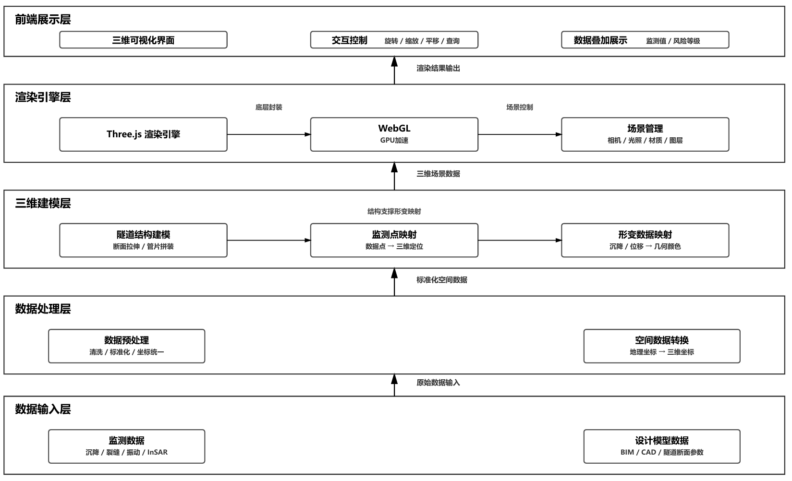

*图7-20 三维数字孪生可视化技术架构图*

### 四、盾构掘进轨迹偏差管控

盾构机掘进轨迹的实时监控与偏差分析是隧道暗挖施工管控的核心内容之一。盾构机在地下掘进过程中，受地层变化、推力分布不均、刀盘磨损等因素影响，其实际行进轨迹会偏离设计轴线，若偏差累积超出容许范围，将导致管片拼装困难甚至隧道线型不合格。针对这一管控需求，系统设计了盾构轨迹追踪功能，从"轨迹总览""偏差分析"和"风险管控"三个维度为工程师提供掘进过程的精细化管控手段。在轨迹总览界面中，系统以环号为横轴绘制盾构偏差剖面图，同时展示各环的水平偏差和垂直偏差，并叠加滑动均值曲线以滤除单环测量噪声、呈现偏差的整体发展趋势，超出±50毫米警戒线的数据点以醒目标记提示，便于工程师快速定位偏差异常区段。工程师选取某一环后，可进一步查看该环的完整掘进参数，包括俯仰角、偏航角、滚转角三个姿态角度，以及推力、扭矩、土仓面压、推进速率和刀盘转速等关键施工参数。系统对每环偏差执行四级评价：偏差绝对值不超过20毫米判定为"正常"，20至35毫米为"关注"，35至50毫米为"警告"，超过50毫米判定为"超限"。在偏差分析方面，系统内置纠偏建议引擎，自动统计最近若干环的偏差均值并与预设的规则库进行匹配，输出针对性的纠偏操作指导——例如"建议适当增加左侧推力以修正右偏趋势"或"建议降低推进速率以控制垂直偏差"。此外，系统还通过逐环累加偏航角变化量的方式计算累积水平偏移量，为工程师评估隧道全线线型质量提供定量依据。

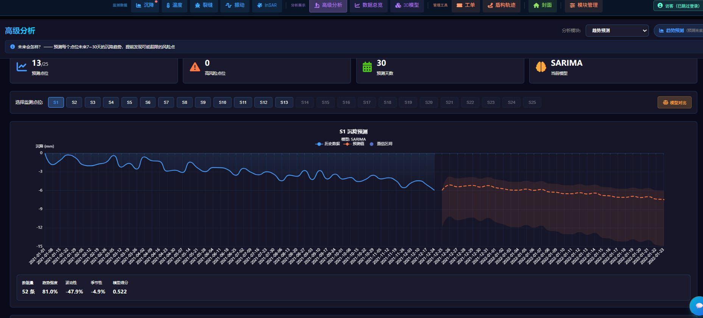

*图7-21 盾构掘进轨迹偏差监控与四级评价示意图*

### 五、项目态势总览与智能诊断

总览仪表盘是系统面向项目管理层的态势感知中枢，其设计目标是帮助管理者从繁杂的多源监测数据中快速把握项目整体安全状态。仪表盘的核心是一套规则化的诊断评分机制：系统以100分为基准，根据各监测点的报警等级、沉降速率、累计变化量和趋势预测等不利因素逐项扣减，最终生成一个0至100分的项目健康评分，并映射为"健康""关注""警告""危险"四个等级。这种量化评分机制使得项目管理者无需逐一翻阅各监测点的数据曲线，即可在短时间内掌握项目整体安全态势。在评分结果的基础上，系统进一步构建了监测要素之间的关联网络，将报警或预警状态的监测点作为核心节点，以图形化方式揭示超限、速率异常、趋势异常等不同类型问题之间的因果关联——例如当多个相邻监测点同时呈现加速沉降趋势时，系统自动标注"同步加速，疑似区域性地层失稳"的关联提示，引导工程师关注系统性风险。仪表盘还将诊断结果转化为面向不同角色的具体操作指令：面向施工工程师的指令侧重于现场复测和加密监测等即时行动；面向数据分析人员的指令侧重于空间关联分析等深度研判任务；面向项目管理者的指令则侧重于施工方案调整等宏观决策建议。

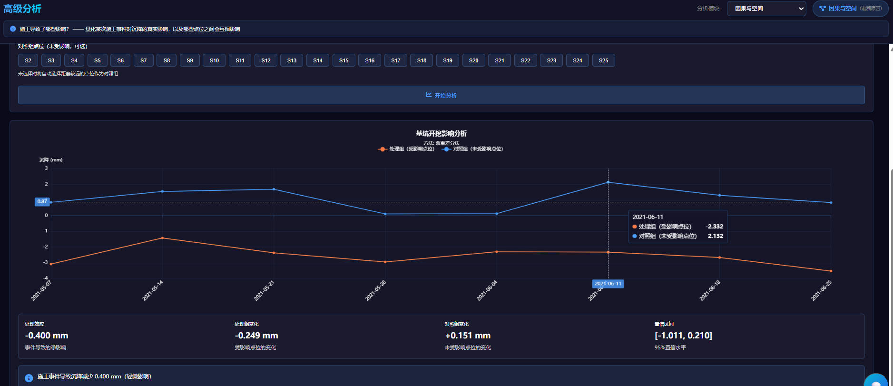

*图7-22 项目态势总览仪表盘与健康评分模型图*

### 六、隧道断面风险分级管控

隧道断面管理模块为工程师提供了从宏观到微观的多层级风险管控视图。该模块采用"项目—线路—风险区段"的三级导航结构，将选定线路按照指定的里程间距划分为若干连续区段，对每个区段综合考虑区段内监测点的当前变化量、变化速率、报警等级和监测点密度等因素，计算综合风险评分并划入安全、关注、警告和危险四个风险等级。系统以里程为横轴绘制全线风险评分分布曲线，工程师可直观识别风险集中区段，同时界面展示排名前列的高风险区段列表，列出各区段的起止里程、监测点数量、最大变化量和风险评分等关键信息，便于快速定位需重点关注的施工地段。隧道断面管理模块与工单系统之间实现了联动：当工程师确认某些区段的风险评分超出管控阈值后，可触发自动工单生成功能，系统将超标区段的风险信息批量转化为施工工单，工单中自动填写区段的起止里程、风险评分和主要风险因素等关键信息。该功能将风险分析结果直接转化为可执行的施工管控任务，是"感知—研判—指令"管控链条在隧道断面维度上的具体体现。

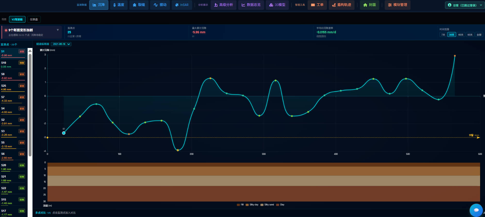

*图7-23 隧道断面风险分级管控与工单联动示意图*

### 七、本节小结

综上所述，本节围绕集群控制与远程管控的主题，主要完成了以下工作：（1）采用Capacitor跨平台框架实现了监测平台的移动端适配，桌面端基于react-grid-layout提供可拖拽的磁贴式仪表盘布局，移动端自动切换为卡片滑动模式，满足了从施工现场到项目办公室的多场景协同管理需求；（2）设计了涵盖六类工单和基于SLA的分级响应时限管理体系，通过NLP快捷输入、后台定时调度和SMTP邮件通知实现了工单全生命周期的数字化管控，并与预警分析模块实现了自动联动，形成了从"异常感知"到"工单下达"的管控闭环；（3）基于Three.js渲染引擎和GLB/glTF模型格式构建了隧道结构三维数字孪生漫游平台，采用iframe沙箱隔离方案解决了三维渲染与前端框架的资源冲突问题，支持里程定位导航和自动巡航检视，实现了空间模型与监测数据的融合展示；（4）建立了盾构掘进轨迹的环级偏差监控与四级评价体系，并通过纠偏建议引擎为工程师提供针对性的操作指导；（5）开发了面向项目管理层的总览仪表盘和隧道断面风险分级管控功能，通过量化健康评分和分区段风险评估，将分散的监测数据凝练为可直接指导行动的管控决策依据。上述功能模块共同构成了一套覆盖"现场巡检—问题上报—智能研判—指令下达—处置闭环"全流程的远程管控体系。
